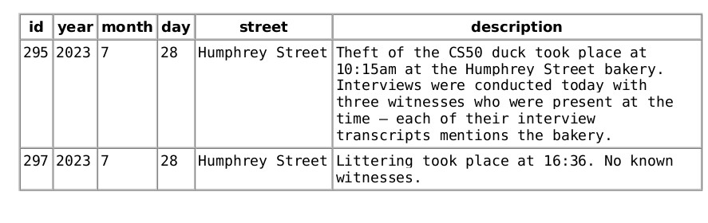
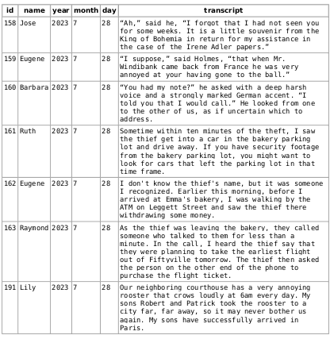

# Query 1:

```sql
SELECT * FROM crime_scene_reports WHERE year = 2023 AND month=7 AND day =28 AND street = "Humphrey Street"
```

```output
```
# Query 2
```sql
SELECT * FROM interviews WHERE year = 2023 AND month=7 AND day =28
```

```output

```

```sql

```

```sql

```

```sql

```

```sql

```
